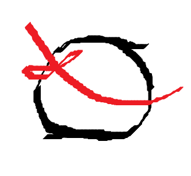

# Proyecto espada

Esta es una app gráfica bien chula, hecha con OpenGL para los gráficos, GLFW para la ventana, y ImGui para la 
interfaz gráfica de usuario. Es un visualizador de espadas 3D, que tiene un alto grado de detalle,
pudiendo jugar con la iluminación, los materiales de cada modelo, las transformaciones de modelado, y la cámara.

Solo funciona en Windows, por ahora

## 30/12/2024 Versión 1.0
La app usa Open GL en modo compatibility profile, que es el origen de Open GL pero que está anticuado a día de hoy.
Lo que se usa a día de hoy es el "Core Profile", que nos permite meternos en las catacumbas del pipeline de rendering y tocarlo todo,
gracias a los "shaders".

Para la siguiente versión que será la 2.0 , la aplicación migrará completamente de Compatibility a Core Profile

*"Per aspera, ad astra"*